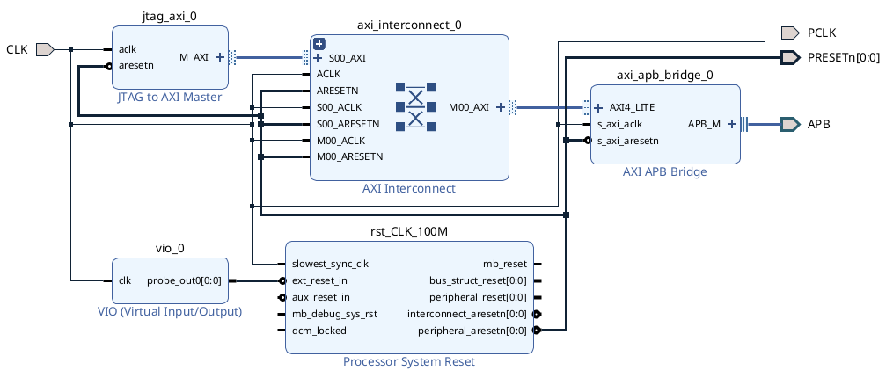

# JESD204B
Модуль канального уровня передатчика работающего по стандарту JESD204B.

## Функционал
- поддержка subclass 0 и subclass 1 режимов;
- 1, 2, 4, 8, 16 октетов в кадре;
- 4, 8, 12, 16, 20, 24, 28, 32 кадра в мультифрейме;
- 1, 2, 4 линии;
- включение/выключение конкретной линии передачи;
- подмена данных внутри ILA на счетчик;
- настраиваемое количество ILA мультифреймов (от 4 до 256);
- настраиваемая задержка между CGS и отправкой ILA (от 1 до 256 мультифреймов).

## Что понадобится для сборки
- [Vivado](https://www.xilinx.com/support/download.html) (использовалась версия 2022.2);
- [PeakRDL](https://peakrdl.readthedocs.io/en/latest/) (html и regblock).

## Как собрать
```bash
cd <папка_с_репозиторием>
make
```

Структура каталогов после сборки:
```bash
.
├── html                    # описание сгенерированного регистрового пространства
├── ip
│   ├── jesd204b_rx         # ядро применика от amd (для тестов)
│   ├── jesd204b_rx_phy     # ядро с трансиверами от amd (для тестов)
│   └── jesd204b_tx_phy     # ядро с трансиверами для передатчика от amd
├── pic
├── prj                     # проект для vivado
├── qa                      # исходники тестовых окружений
├── rdl                     # описание регистровго пространства на SystemRDL
├── regblock                # сгенерированные аппаратные исходники регистровой карты
├── scripts                 # проектные ограничения, скрипты сборки проекта и block design'а
└── src
    └── core                # аппаратные исходники модуля канального уровня
```

## Модуль и его структура

<p align="center" width="100%">
    
</p>

### Устройство управления (cu)
Отслеживание состояния ~SYNC сигнала, управление последовательностью установки соединения в зависимости от выбранного подкласса.
### Генератор LMFC (lmfc)
Генерирование стробов начала/конца фрейма/мультифрейма и их синхронизация с LMFC в других конвертерах посредством первого активного фронта SYSREF'а
### Генератор ILA мультифреймов (ila)
Генерирование ILA мультифреймов для процедуры начального выравнивания линий. Включается после синхронизации кодовой группы, подменяя поток K28.5 символов. После генерации заданного количества мультифреймов переключается на проброс данных на входе канального уровня.
### Модуль вставки служебных символов (char_replace)
Включается после завершения процедуры выравнивания линий, предназначен для замены последнего октета в мультифрейме на служебный символ.

## Интеграция в СнК
Для настройки через шиныне интерфейсы в рамках сборки из описания на SystemRDL генерируются аппаратные исходники регистровой карты с интерфейсом APB4. В модуле `src/jesd204_tx.sv` содержится описание подключения регистровой карты.

<p align="center" width="100%">
    
</p>

Предполагается что модуль транспортного уровня и регистровая карта принадлежат разным тактовым доменам.

## Интеграция с трансиверами
Базовый сценарий: использование модуля транспортного уровня в проектах под ПЛИС семейства Kintex Ultrascale. Подключение к трансиверам описано в модуле `src/jesd204_tx_env.sv`. 

<p align="center" width="100%">
    
</p>

В качестве трансиверов используется ядро [jesd phy](https://www.xilinx.com/products/intellectual-property/ef-di-jesd204-phy.html) от amd, которое по сути является обвязкой над ядром gth трансивера с включенным common примитивом.<br>
В случае использования трансиверов предусматривается два дополнительных тактовых сигнала: `QPLL_REFCLK` для ФАПЧ внутри квада и `DRPCLK` для интерфейса.

## Модуль верхнего уровня
В качестве примера проекта для сборки предлагается связка из окружения имитирующего наличие процессора и модуль с интеграцией с трансиверами.<br>
Окружение с имитацией процессора представлено ниже:<br>

<p align="center" width="100%">
    
</p>

Реализация в модуле `src/top.sv`. Схема представлена ниже:<br>

<p align="center" width="100%">
    
</p>

Регистровое пространство модуля транспортного уровня и регистровое пространство трансиверов находятся в одном тактовом домене. Проектные ограничения находятся в `scripts/top.xdc`.<br>
Подразумевается что модуль транспортного уровня тактируется сигналом по частоте равной скорости работы линии деленной на 40 (в проекте это 200 МГц). Частота тактового сигнала для ФАПЧ внутри квада трансиверов такая же. <br>
В качестве данных для отправки по JESD204B интефрейсу

## Тестовое окружение
В `qa/tx_tb.sv` описано следующее базовое тестовое окружение:<br>

<p align="center" width="100%">
    
</p>

Окружение с транспортным уровнем, регистрами и трансиверами тут подключено к связке ядер от amd реализующими функционал приемника; внутри окружения описаны два процесса для генерации тестовых данных и их сравнения после прохождения через передатчик и приемник.


## Ссылки
[Serial Interface for Data Converters](https://www.jedec.org/sites/default/files/docs/JESD204B.pdf])
